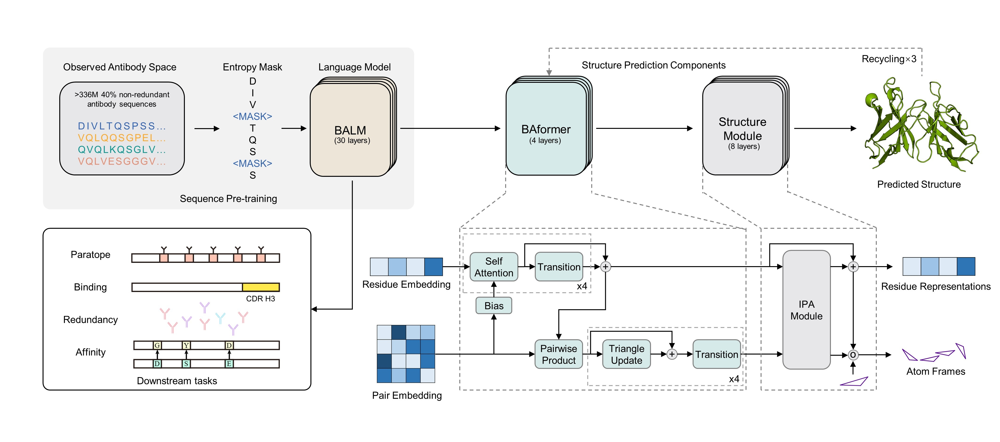

# Bio-Inspired Antibody Language Model (BALM)
This repository contains inference code for **Accurate Prediction of Antibody Function and Structure Using Bio-Inspired Antibody Language Model**


## Create Environment
```
conda env create -f environment.yml
conda activate BALM
```

## Preparation
The pre-trained weights of BALM can be downloaded from Google Drive link: [pretrained-BALM](https://drive.google.com/drive/folders/1foy264CIawBIT3QFTdc6JBVxw6MQfvQd?usp=sharing)

## Run inference

```
from modeling_balm import BALMForMaskedLM
from ba_position_embedding import get_anarci_pos
from transformers import EsmTokenizer
import torch

# an antibody sequence example
input_seq = "AVQLQESGGGLVQAGGSLRLSCTVSARTSSSHDMGWFRQAPGKEREFVAAISWSGGTTNYVDSVKGRFDISKDNAKNAVYLQMNSLKPEDTAVYYCAAKWRPLRYSDNPSNSDYNYWGQGTQVTVSS"

tokenizer = EsmTokenizer.from_pretrained("./tokenizer/vocab.txt", do_lower_case=False, model_max_length=168)

tokenizer_input = tokenizer(input_seq, truncation=True, padding="max_length", return_tensors="pt")
# generate position_ids
tokenizer_input.update(get_anarci_pos(input_seq))

with torch.no_grad():
    # please download from Google drive link before
    model = BALMForMaskedLM.from_pretrained("./pretrained-BALM/")
    # on CPU device
    outputs = model(**tokenizer_input, return_dict=True, output_hidden_states=True, output_attentions=True)

    # final hidden layer representation [batch_sz * max_length * hidden_size]
    final_hidden_layer = outputs.hidden_states[-1]
    
    # final hidden layer sequence representation [batch_sz * hidden_size]
    final_seq_embedding = final_hidden_layer[:, 0, :]
    
    # final layer attention map [batch_sz * num_head * max_length * max_length]
    final_attention_map = outputs.attentions[-1]
```

## BALMFold server
[BALMFold](https://beamlab-sh.com/models/BALMFold) is based on BALM to predict antibody tertiary structure with primary sequence. Just try it. :)

## Citations
If you find our model is useful for you, please cite as:

TODO

The architecture and pre-training process of BALM builds on the ESM and Hugging Face modeling framework. We really appreciate the work of [ESM](https://github.com/facebookresearch/esm) and [Hugging Face](https://huggingface.co/) team.


